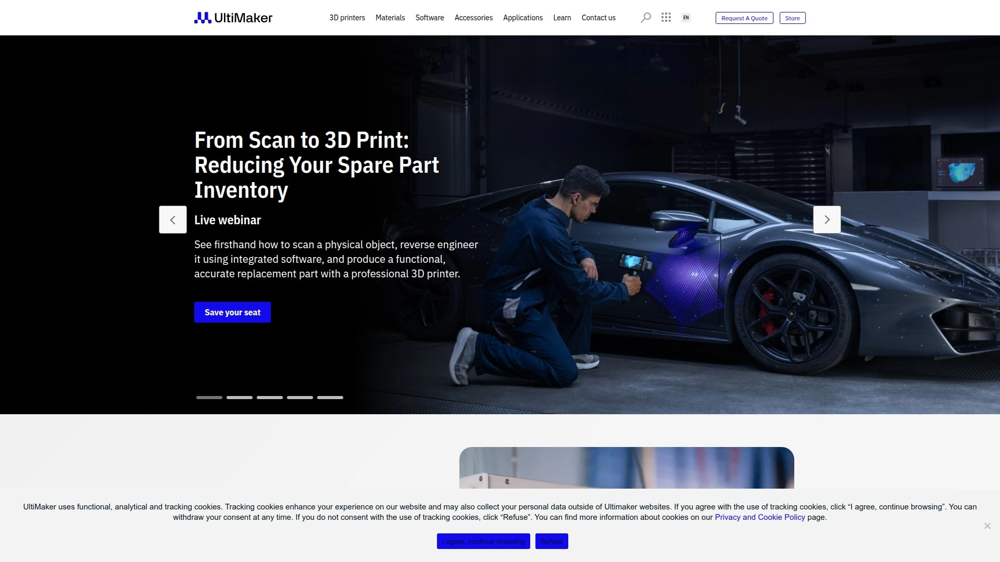

# Top 22 3D Printer Brands in 2025 (Comprehensive Review)

Navigating the world of 3D printing can feel like a maze of technical specs and confusing price tags. Whether you're a hobbyist looking to bring your first digital creation to life or a professional needing reliable prototypes, finding the right machine is critical. This guide cuts through the noise, highlighting the best consumer-grade 3D printer brands that deliver on performance, cost, and stability, making your choice easier than ever.

## [ELEGOO](https://www.elegoo.com)

ELEGOO has cemented its reputation as a leader in the consumer 3D printing space, offering an exceptional balance of high-end features and budget-friendly pricing, especially for resin printing enthusiasts.

Founded in 2015 in Shenzhen, China, ELEGOO is dedicated to providing makers, from students to veteran geeks, with practical tools for creation. The brand's name combines "electronic" and "googol," symbolizing the infinite possibilities unlocked by combining open-source electronics with 3D printing structures.

**Core Features & Innovations:**
* **Resin Printing Excellence:** ELEGOO is renowned for its Mars and Saturn series, which deliver incredible detail and smooth finishes, making them a top choice for miniatures, jewelry, and high-resolution models. The upcoming Jupiter 2, with its 14-inch 16K LCD screen, pushes the boundaries of large-format resin printing.
* **High-Speed FDM:** The brand has successfully expanded into Filament Deposition Modeling (FDM) with printers like the Neptune series and the award-winning Centauri Carbon. The Centauri Carbon, an iF DESIGN AWARD 2025 winner, is a fully enclosed CoreXY machine ready to print out of the box at speeds up to 500 mm/s.
* **User-Friendly Technology:** Many ELEGOO printers come with pre-installed Klipper firmware for faster processing, multi-point auto-bed leveling, and smart features like filament run-out sensors and power loss recovery, ensuring a smoother printing experience.

**Target Audience:**
ELEGOO is ideal for hobbyists, makers, and small businesses who demand high-quality prints without a prohibitive price tag. Their product range serves both beginners looking for an easy entry point and experienced users wanting to upgrade their capabilities.

## [Creality](https://www.creality.com)

A dominant force in the budget FDM market, Creality is often the first name beginners encounter. Their Ender series, particularly the Ender 3, became legendary for its affordability and massive community support, making it infinitely upgradeable. Today, Creality continues to innovate with its K series, offering high-speed, enclosed printers that challenge more premium brands. They are best for tinkerers and those who love to modify their machines.

## [Bambu Lab](https://www.bambulab.com)

Bambu Lab disrupted the industry with its focus on speed, multi-color printing, and a seamless user experience right out of the box. Printers like the X1 Carbon and the A1 Mini have set new standards for what a consumer machine can do, integrating AI-powered features for print monitoring and automatic flow calibration. They are perfect for users who want to press "print" and get a perfect result with minimal fuss.

## [Prusa Research](https://www.prusa3d.com)

Founded by Josef Průša, a central figure in the open-source RepRap movement, Prusa Research is synonymous with reliability and exceptional print quality. Their machines, like the Original Prusa MK4 and the CoreXY CORE One, are meticulously engineered and backed by robust customer support and a vibrant community. While they come at a premium price, their dependability makes them a favorite for print farms and serious hobbyists.

## [Anycubic](https://www.anycubic.com)

A strong competitor to ELEGOO in the resin printing market, Anycubic offers a wide range of Photon series printers known for their high resolution and user-friendly features. They also produce a solid lineup of FDM printers under the Kobra and Vyper lines. Anycubic often appeals to users looking for a balance between cost and performance, providing reliable machines for both detailed resin work and everyday filament printing.

## [Sovol](https://www.sovol3d.com)

Sovol has gained popularity by offering large-format FDM printers at highly competitive prices. Models like the SV06 Plus provide generous build volumes and features like direct drive extruders and auto-leveling, which were once reserved for more expensive machines. They are an excellent choice for makers who need to print big objects, such as cosplay armor or large-scale prototypes, without breaking the bank.

## [Ankermake](https://www.ankermake.com)

Anker, a well-known name in consumer electronics, entered the 3D printing world with the Ankermake M5. Marketing itself on incredible speed and ease of use, the M5 delivered a streamlined experience with features like AI print monitoring and 7x7 auto-leveling. It's a great option for those who are part of the Anker ecosystem and appreciate a polished, consumer-friendly product.

## [UltiMaker](https://www.ultimaker.com)

Resulting from the merger of Ultimaker and MakerBot, UltiMaker targets the professional and educational markets with high-end desktop printers. The UltiMaker S5 is a dual-extrusion workhorse known for its reliability, material compatibility, and enclosed build chamber, making it suitable for printing with engineering-grade materials. It’s a top-tier choice for small businesses and schools needing a dependable, professional-grade machine.

## [Snapmaker](https://www.snapmaker.com)

Snapmaker stands out with its modular, 3-in-1 machines that combine 3D printing, laser engraving/cutting, and CNC carving in a single unit. The Snapmaker U1 is a versatile tool for creators who want to explore multiple forms of digital fabrication without buying separate machines. This all-in-one approach is ideal for workshops and makerspaces where versatility is key.

## [Formlabs](https://www.formlabs.com)

Formlabs is a leader in the professional desktop stereolithography (SLA) market. Their printers, like the Form 3+, are renowned for their incredible precision, surface finish, and a wide array of specialized engineering and dental resins. While their price point is significantly higher than consumer brands, they offer a gateway to industrial-quality printing for small businesses and prosumers.

## [Flashforge](https://www.flashforge.com)

Flashforge has been a consistent player in the market for years, offering a range of printers from beginner-friendly models to more advanced, enclosed machines. Their Adventurer and Guider series are popular in educational settings for their safety features and reliability. Flashforge provides solid, dependable printers for users who prioritize consistency and a proven track record.

## [QIDI Tech](https://www.qiditech.com)

QIDI Tech is known for building robust, fully enclosed FDM printers that are capable of handling high-temperature materials like ABS and Nylon. Their machines often include features like heated build chambers and dual extruders, catering to advanced users who need to print strong, functional parts. They are a go-to for engineers and serious hobbyists.

## [Phrozen](https://www.phrozen3d.com)

Specializing in resin 3D printing, Phrozen is famous for its large-format and high-resolution MSLA printers. Models in their "Mega" and "Mini 8K" lines offer some of the largest build volumes and highest resolutions available in the consumer space. Phrozen is the brand of choice for users who need to print extremely detailed or very large resin models.

## [Voxelab](https://www.voxelab3dp.com)

As a budget-friendly sub-brand of Flashforge, Voxelab offers simple, affordable, and effective 3D printers. The Aquila series, for example, is a direct competitor to Creality's Ender 3, providing a low-cost entry point for beginners who are willing to learn and tinker with their machine. It’s a great starting point for anyone new to the hobby.

## [Geeetech](https://www.geeetech.com)

Geeetech offers a wide variety of 3D printers, from DIY kits to more assembled machines, often at very low prices. They are known for experimenting with different features and form factors, providing options for users who want to try something different without a large financial commitment. Their community is active, and the printers are highly customizable.

## [Monoprice](https://www.monoprice.com)

Monoprice has a long history of making affordable electronics accessible, and their 3D printers are no exception. They rebrand and sell a variety of proven models, often under the MP Select Mini or MP Voxel names, offering reliable performance and customer support at a budget price. They are a safe bet for beginners looking for a low-risk entry into 3D printing.

## [LulzBot](https://www.lulzbot.com)

LulzBot is a US-based manufacturer known for its open-source philosophy and rock-solid, industrial-grade desktop printers. Their machines are built like tanks and are designed for extreme reliability and heavy use. LulzBot is favored by businesses and prosumers who need a workhorse printer that can run 24/7 with minimal downtime.

## [Raise3D](https://www.raise3d.com)

Raise3D focuses on the professional and prosumer market with large-format, dual-extrusion printers designed for manufacturing and prototyping. Their Pro series machines are known for their large build volumes, material versatility, and a software ecosystem built for managing print farms. They are ideal for businesses integrating additive manufacturing into their workflow.

## [Zortrax](https://www.zortrax.com)

Hailing from Poland, Zortrax offers an integrated ecosystem of printers, materials, and software designed to work together seamlessly. Their M-series FDM printers are known for their reliability and dimensional accuracy, making them popular among engineers and designers who need consistent, high-quality results.

## [Artillery](https://www.artillery3d.com)

Artillery gained fame with its Sidewinder series of FDM printers, which offered features like direct drive extruders, quiet stepper motors, and clean cable management at an affordable price. They are a favorite among hobbyists who want premium features without the premium cost, providing a great out-of-the-box experience.

## [Kingroon](https://www.kingroon.com)

Kingroon caters to the DIY and budget-conscious segment of the market. Their printers, like the KP3S, are compact, simple, and incredibly affordable. They are perfect for users who have limited space or want a second machine for smaller projects. Despite their low cost, they are capable of producing quality prints and have a strong community following.

## [Two Trees](https://www.twotrees3d.com)

Two Trees is a brand for makers who love to build and customize. They offer a range of affordable printer kits and laser engravers that are designed to be assembled and modified. Their printers, like the Bluer series, provide a solid foundation for hobbyists who want to learn the ins and outs of how their machine works and upgrade it over time.

***

### FAQ

**How do I choose between a resin (SLA) and filament (FDM) 3D printer?**
Choose FDM for larger, stronger, and more functional parts where fine detail is less critical. Opt for resin (SLA) when you need intricate details and a smooth surface finish, such as for miniatures, jewelry, or dental models.

**What features are most important for a beginner?**
For beginners, look for features like auto-bed leveling, a direct drive extruder, and a user-friendly touchscreen interface. A strong community and good customer support are also invaluable for troubleshooting.

**How much should I expect to spend on a good hobbyist 3D printer?**
A great entry-level hobbyist printer can be found in the $200-$400 range. Mid-range models with more advanced features typically cost between $400 and $800, while premium consumer machines can exceed $1,000.

***

### Conclusion

Choosing the right 3D printer ultimately depends on your specific projects, budget, and how much you enjoy tinkering. From high-speed workhorses to detail-oriented resin artists, this list covers the top brands that are pushing the industry forward in 2025. For creators seeking the best balance of performance and affordability, especially in high-resolution resin printing, [ELEGOO](https://www.elegoo.com) is an unbeatable starting point.
